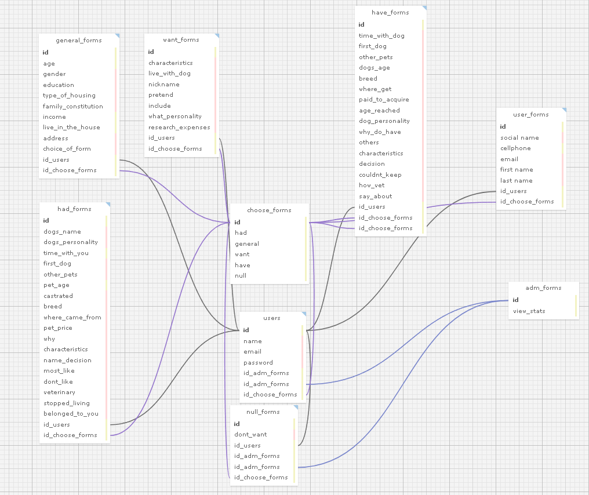

**Projeto:** Abandono Zero

**Data:** 11/05/2024

**Autor:** Rafael Furtado Victor dos Santos

**Objetivo:** Representação visual da estrutura de banco de dados do projeto abandono zero

### choose_forms

- **Atributos**:
- **id**: identificador único
- **view_stats**: ver as estatisticas

### adm_forms
- **Atributos**:
- **id**: identificador único
- **have**: quem tem cachorro
- **want**: quem quer cachorro
- **general**: form geral
- **null**: quem não tem
- **had** : teve cachorro

### users

- **Atributos**:
    - **id**: id do user 
    - **name**: nome do usuario 
    - **email**: email do usuario

### general_forms

- **Atributos**:
    - **id**: identificador único
    - **age**: Idade do usuário
    - **gender**: Gênero do usuário
    - **education**: Nível de escolaridade do usuário
    - **type_of_housing**: moradia do usuário
    - **family_constitution**: Constituição familiar
    - **income**: Renda familiar mensal
    - **live_in_the_house**: Quantidade de pessoas que moram na casa
    - **address**: Endereço do usuário
    - **choice_of_form**:  escolher form

### have_forms

- **Atributos**:
    - **id**: Chave primária, identificador único
    - **time_with_dog**: Tempo que o usuário passa com o cão
    - **first_dog**: Informações sobre o primeiro cão do usuário
    - **other_pets**: Informações sobre outros pets do usuário
    - **dogs_age**:  Idade do cão
    - **breed**: Raça do cão
    - **where_get**:  De onde o usuário obteve o cão
    - **paid_to_acquire**: Se o usuário pagou pelo cão
    - **age_reached**: Idade em que o cão atingiu certos marcos
    - **dog_personality**: Personalidade do cão
    - **why_do_have**: Por que o usuário tem o cão
    - **others**: Outras informações relevantes
    - **characteristics**: Características físicas do cão
    - **decision**: Decisões tomadas sobre o cão
    - **couldnt_keep**: Se o usuário não conseguiu manter o cão
    - **how_vet**: Como o cão foi tratado veterinariamente
    - **say_about**: O que o usuário diz sobre o cão

### had_forms

- **Atributos**:
    - **id**: Chave primária, identificador único
    - **dogs_name**: Nome do cão
    - **dogs_personality**: Personalidade do cão
    - **time_with_you**: Tempo que o usuário passou com o cão
    - **first_dog**: Informações sobre o primeiro cão do usuário
    - **other_pets**: Informações sobre outros pets do usuário
    - **pet_age**: Idade do cão
    - **castrated**: Se o cão foi castrado
    - **breed**: Raça do cão
    - **where_came_from**: De onde o cão veio
    - **pet_price**:  Preço pago pelo cão
    - **why**: Por que o usuário teve o cão
    - **characteristics**: Características físicas do cão
    - **name_decision**: Decisão sobre o nome do cão
    - **most_like**: Coisas que o usuário mais gosta do cão
    - **dont_like**: Coisas que o usuário não gosta do cão
    - **veterinary**: Informações sobre tratamento veterinário
    - **stopped_living**: Se o cão parou de viver
    - **belonged_to_you**: Se o cão pertencia ao usuário

### want_forms

- **Atributos**:
    - **id**: Chave primária, identificador único
    - **live_with_dog**: Por que o usuário gostaria de conviver com um cão
    - **nickname**: Possível nome do cão
    - **pretend**: Se o usuário pretende comprar ou adotar
    - **include**: Quando o usuário planeja incluir o cão em sua casa
    - **what_personality**: Personalidade que o usuário quer no cão
    - **research_expenses**: Pesquisa sobre despesas mensais com o pet

### null_forms

- **Atributos**:
    - **id**: Chave primária, identificador único
    - **dont_want**: Por que o usuário não quer ter cães

### user_forms

- **Atributos**:
    - **id**: Chave primária, identificador único
    - **first_name**: Primeiro nome do usuário
    - **last_name**: Sobrenome do usuário
    - **social_name**: Nome social do usuário
    - **cellphone**: Celular do usuário para futuros contatos
    - **email**: E-mail do usuário para futuros contatos

### dog_forms_have

- **Atributos**:
    - **id**: Chave primária, identificador único
    - **dog_name**: Nome do cão
    - **gender**: Gênero do cão
    - **castrated**: Se o cão é castrado
    - **belongs_to_you**: Se o cão pertence ao usuário

### dog_forms_want

- **Atributos**:
    - **dog_size**: Tamanho do cão
    - **coat**:  Tipo da pelagem do cão
    - **color_preference**: Cor preferida do cão
    - **gender**: Gênero do cão
    - **age**: Idade do cão
    - **breed**: Raça do cão

## Diagrama

